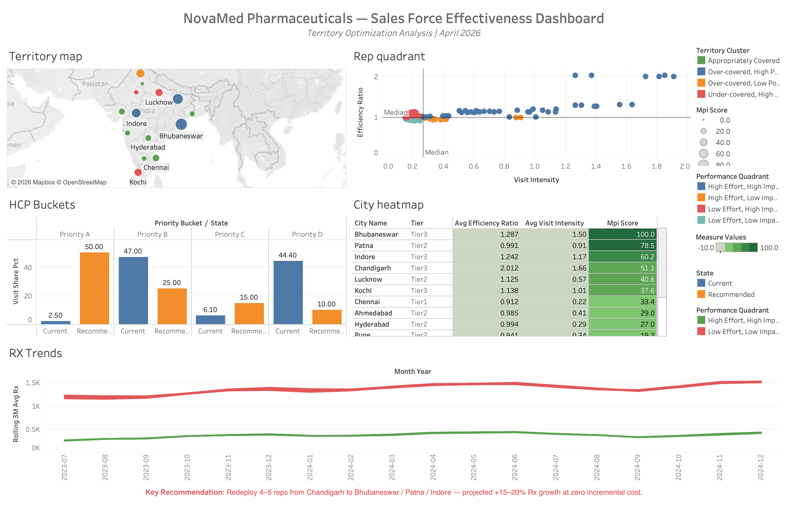
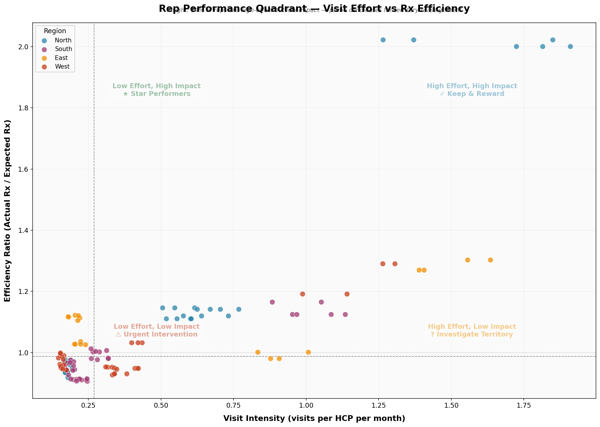
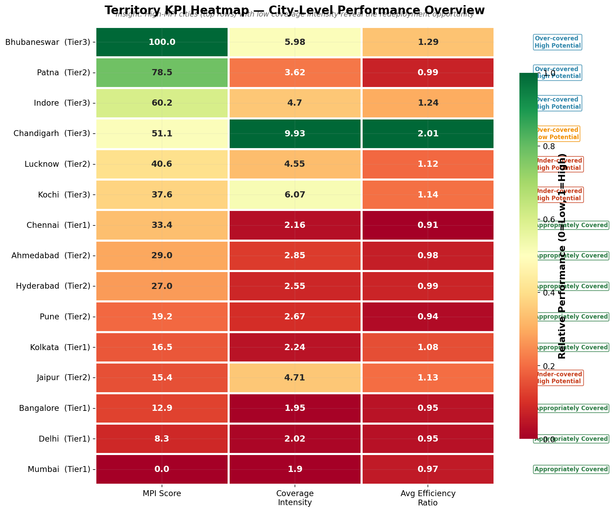
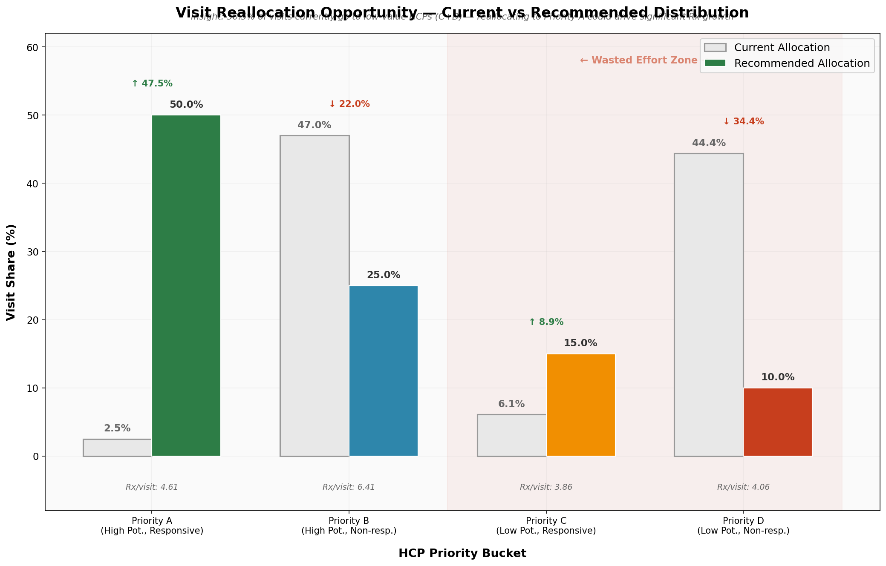
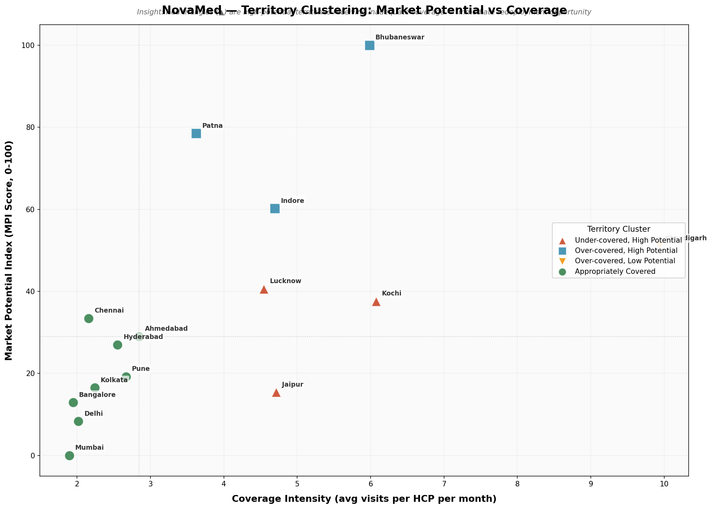
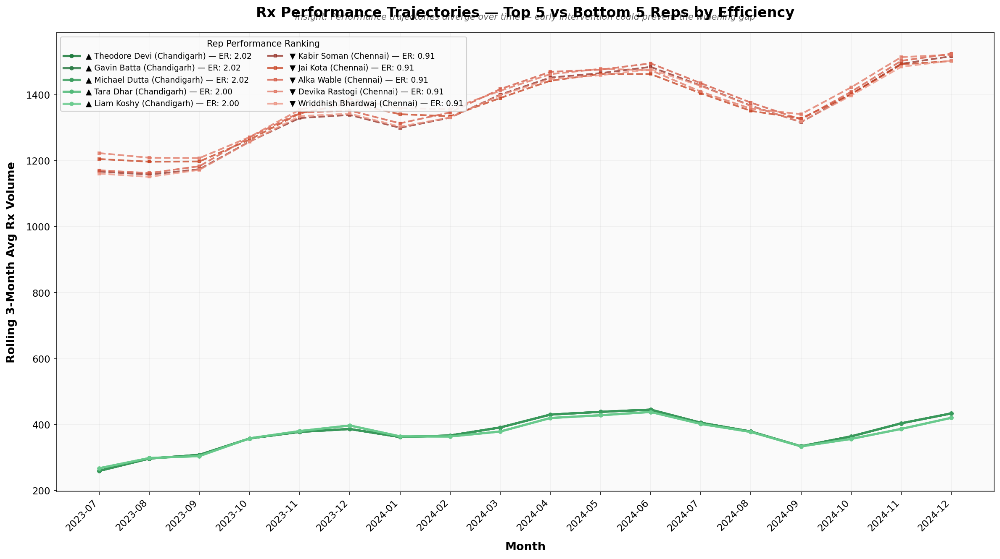

# NovaMed Pharmaceuticals — Sales Force Effectiveness & Territory Optimization

> **A consulting-grade analytical framework for optimizing a 120-rep pharmaceutical sales force across 15 Indian cities — culminating in an interactive Tableau dashboard.**

[](https://python.org)
[](https://sqlite.org)
[](https://public.tableau.com)
[](https://jupyter.org)

---

## Dashboard



*The complete Tableau dashboard synthesizes five analytical views into a single decision-support surface for NovaMed's VP of Sales.*

---

## The Problem

**NovaMed Pharmaceuticals** (fictional) deploys **120 field sales reps** across **15 Indian cities** to promote two drugs — **CardioMax** (cardiac) and **GlucoShield** (diabetes). The VP of Sales suspects significant **territory misalignment**: some reps are over-deployed in low-potential areas while high-potential territories are under-resourced. The company spends **₹18 crore annually** on the sales force with no systematic way to measure deployment efficiency.

**This project builds the complete analytical framework to diagnose the problem, quantify the waste, and recommend specific redeployment actions.**

---

## Dashboard Deep-Dive

The Tableau dashboard is composed of **5 interconnected panels**, each addressing a different dimension of sales force effectiveness:

### 1. Territory Map

A geographic view of all 15 cities plotted on an India map. Bubble size encodes **MPI Score** (Market Potential Index) while color encodes **Territory Cluster** assignment:

| Cluster | Color | Description |
|---------|-------|-------------|
| Appropriately Covered | Green | Balanced rep deployment relative to market potential |
| Over-covered, High Potential | Blue | Too many reps — but the market warrants presence |
| Over-covered, Low Potential | Orange | Prime candidates for rep redeployment out |
| Under-covered, High Potential | Red | Highest-priority gap — redeploy reps here |

Cities like **Bhubaneswar** and **Lucknow** stand out as large bubbles (high MPI) with red/orange cluster designations, signaling the redeployment opportunity.

---

### 2. Rep Performance Quadrant

A scatter plot of all 120 reps on two axes — **Visit Intensity** (x-axis) vs **Efficiency Ratio** (y-axis) — split by median lines into four quadrants:

| Quadrant | Meaning | Action |
|----------|---------|--------|
| **High Effort, High Impact** (top-right, green) | Working hard in the right territories | Retain and reward |
| **High Effort, Low Impact** (bottom-right, orange) | Working hard in the wrong territories | Redeploy — territory problem, not a people problem |
| **Low Effort, High Impact** (top-left, red) | Efficient but under-utilized | Increase call load or expand territory |
| **Low Effort, Low Impact** (bottom-left, red) | Low activity, low results | Investigate — coaching or territory issue |

Bubble size encodes **MPI Score** of the rep's territory — larger bubbles in low-impact quadrants confirm that territory assignment, not rep effort, is the root cause.

---

### 3. HCP Buckets — Current vs Recommended

A grouped bar chart comparing **current visit share** against the **recommended allocation** across four HCP priority buckets:

| Priority Bucket | Current Visit Share | Recommended Visit Share | Gap |
|-----------------|--------------------:|------------------------:|----:|
| **Priority A** (High Potential + Responsive) | 2.50% | 50.00% | +47.5 pp |
| **Priority B** (High Potential + Unresponsive) | 6.10% | 25.00% | +18.9 pp |
| **Priority C** (Low Potential + Responsive) | 47.00% | 15.00% | −32.0 pp |
| **Priority D** (Low Potential + Unresponsive) | 44.40% | 10.00% | −34.4 pp |

> **50.5% of all rep visits go to Priority C + D HCPs** — doctors who either lack prescription potential or don't respond to detailing. Redirecting this effort to Priority A alone could unlock 15–20% incremental Rx growth.

---

### 4. City Heatmap

A sortable table ranking all 15 cities by key performance metrics with color-coded MPI scores (green = high, red = low):

| City | Tier | Avg Efficiency Ratio | Avg Visit Intensity | MPI Score |
|------|------|---------------------:|--------------------:|----------:|
| **Bhubaneswar** | Tier 3 | 1.287 | 1.50 | **100.0** |
| **Patna** | Tier 2 | 0.991 | 0.91 | **78.5** |
| **Indore** | Tier 3 | 1.242 | 1.17 | **60.2** |
| Chandigarh | Tier 3 | 2.012 | 1.66 | 51.1 |
| Lucknow | Tier 2 | 1.125 | 0.57 | 40.6 |
| Kochi | Tier 3 | 1.138 | 1.01 | 37.6 |
| Chennai | Tier 1 | 0.912 | 0.22 | 33.4 |
| Ahmedabad | Tier 2 | 0.985 | 0.41 | 29.0 |
| Hyderabad | Tier 2 | 0.994 | 0.29 | 27.0 |

*Chandigarh's efficiency ratio of 2.012 with an MPI of only 51.1 confirms over-coverage — reps there are efficient because there are too many of them relative to the market size.*

---

### 5. Rx Trends

A rolling 3-month average line chart tracking prescription volume from **July 2023 to December 2024**. The top-performing reps (green line) sustain ~1.5K Rx/month while bottom performers hover near baseline. The widening gap over time confirms that early redeployment intervention prevents further divergence.

**Key Recommendation** (embedded in dashboard):
> *Redeploy 4–5 reps from Chandigarh to Bhubaneswar / Patna / Indore — projected +15–20% Rx growth at zero incremental cost.*

---

## Key Findings

| Finding | Impact |
|---------|--------|
| **50.5% of rep visits** go to low-priority HCPs (Priority C+D) where visits don't drive prescriptions | Massive reallocation opportunity — half of all field activity is wasted |
| **Chandigarh** has 6 reps for a Tier 3 city — 9.9 visits per HCP per month (3.5× the median) | Most over-deployed territory; reps should be redeployed to high-MPI cities |
| **Bhubaneswar** (MPI: 100), **Patna** (78.5), **Indore** (60.2) are the highest-potential markets but have only 4 reps each | Under-resourced territories with the largest untapped Rx opportunity |
| **17 reps (14%)** are in the "High Effort, Low Impact" quadrant — working hard in the wrong territories | Territory reassignment (not performance coaching) is the correct intervention |
| **Switcher HCPs** show 6.2% post-visit Rx lift; **Brand Loyal** and **Competitor Loyal** show <2% | Proves that **targeting matters more than volume** — visit the right doctors, not more doctors |

### Projected Business Impact

| Metric | Current | Post-Implementation |
|--------|---------|---------------------|
| Wasted effort (visits to C+D HCPs) | 50.5% | ~25% |
| Under-covered high-potential HCPs | ~50 | <15 |
| Incremental Rx growth (targeted territories) | Baseline | +15–20% |
| Estimated annual revenue impact | — | ₹2–3 crore |
| Implementation cost | — | **₹0** (cost-neutral redeployment) |

---

## Analytical Framework

The project consists of **8 components** that build on each other:

```
┌─────────────────────────────────────────────────────────────────┐
│  COMPONENT 1: SQL Diagnostics                                   │
│  4 queries: rep ranking, post-visit Rx lift, coverage gaps,     │
│  rolling Rx trends                                               │
├─────────────────────────────────────────────────────────────────┤
│  COMPONENT 2: Market Potential Index (MPI)                      │
│  0–100 score per city (specialist density 40% + disease         │
│  prevalence 40% + market accessibility 20%)                      │
├─────────────────────────────────────────────────────────────────┤
│  COMPONENT 3: Rep Efficiency Ratio                              │
│  Actual Rx ÷ Expected Rx (adjusted for territory quality)       │
│  + Performance Quadrant (effort vs impact)                       │
├─────────────────────────────────────────────────────────────────┤
│  COMPONENT 4: HCP Prioritization                                │
│  2,000 doctors → 4 priority buckets (potential × responsiveness)│
│  + "Wasted Effort" metric (50.5%)                                │
├─────────────────────────────────────────────────────────────────┤
│  COMPONENT 5: Territory Clustering                              │
│  K-Means (k=4) on MPI × coverage intensity                     │
│  → 4 strategic territory types with management actions           │
├─────────────────────────────────────────────────────────────────┤
│  COMPONENT 6: Visualizations (5 publication-quality charts)     │
├─────────────────────────────────────────────────────────────────┤
│  COMPONENT 7: Master Jupyter Notebook                           │
│  End-to-end narrative with inline outputs + recommendations      │
├─────────────────────────────────────────────────────────────────┤
│  COMPONENT 8: Tableau Dashboard                                  │
│  5 interactive panels + packaged .twbx workbook                  │
└─────────────────────────────────────────────────────────────────┘
```

---

## Visualizations (Python)

In addition to the Tableau dashboard, the project includes **7 publication-quality matplotlib/seaborn charts**:

### Rep Performance Quadrant


*Each dot is one rep. The bottom-right quadrant (High Effort, Low Impact) identifies 17 reps working hard in the wrong territories — prime redeployment candidates.*

### Territory KPI Heatmap


*Cities ranked by Market Potential Index. Bhubaneswar (MPI: 100) and Chandigarh (coverage: 9.93) are the most striking outliers.*

### Wasted Effort — Current vs Recommended


*Only 2.5% of visits go to Priority A HCPs (high potential + responsive). The recommended distribution shifts 47.5% more visit share to these highest-ROI targets.*

### Territory Clusters


*K-Means clustering reveals Chandigarh as a clear outlier (over-covered, low potential) and the Bhubaneswar–Patna–Indore cluster as under-covered but high potential.*

### Rx Performance Trajectories


*Top 5 reps (green, Chandigarh) vs bottom 5 (red, Chennai). The performance gap widens over time — early intervention prevents further divergence.*

---

## Project Structure

```
novamed-sfe/
├── README.md                          ← You are here
├── PLAN.md                            ← Build tracker & analytical decisions
├── data/
│   ├── raw/                           ← 5 synthetic datasets (cities, reps, HCPs, visits, Rx)
│   └── processed/                     ← 10 analytical outputs from all components
├── sql/
│   ├── rep_ranking.sql                ← Window function ranking (RANK OVER PARTITION BY)
│   ├── visit_rx_lag.sql               ← Post-visit Rx lift via self-join
│   ├── hcp_coverage.sql               ← Coverage gap identification (quartile analysis)
│   └── rolling_rx_trend.sql           ← 3-month rolling averages (window functions)
├── analysis/
│   ├── generate_data.py               ← Synthetic data with embedded business patterns
│   ├── load_db.py                     ← SQLite pipeline (load + execute queries)
│   ├── market_potential_index.py      ← Component 2: MPI scoring
│   ├── rep_efficiency.py              ← Component 3: Efficiency ratio + quadrant
│   ├── hcp_categorization.py          ← Component 4: Priority buckets + wasted effort
│   ├── territory_clustering.py        ← Component 5: K-Means clustering
│   ├── visualizations.py              ← Component 6: 5 polished charts
│   ├── export_tableau.py              ← Component 8: Tableau CSV exports
│   └── create_notebook.py             ← Component 7: Notebook generator
├── notebooks/
│   └── novamed_sfe_analysis.ipynb     ← Master notebook (44 cells, end-to-end)
└── outputs/
    ├── charts/                        ← 7 publication-quality PNG charts
    └── tableau/
        ├── novamed_sfe.twbx           ← Packaged Tableau workbook (open directly)
        ├── novamed_sfe_dashboard.png  ← Dashboard screenshot
        ├── 5 × Tableau-ready CSVs     ← Wide-format, fully denormalized
        └── TABLEAU_BUILD_GUIDE.md     ← Step-by-step dashboard build spec
```

---

## How to Run

### Prerequisites
```bash
pip install pandas numpy faker matplotlib seaborn scikit-learn nbformat
```

### Full Pipeline (generates all data, runs all analysis, produces all outputs)
```bash
# 1. Generate synthetic data
python analysis/generate_data.py

# 2. Load into SQLite + run SQL queries
python analysis/load_db.py

# 3. Market Potential Index
python analysis/market_potential_index.py

# 4. Rep Efficiency Ratio
python analysis/rep_efficiency.py

# 5. HCP Categorization
python analysis/hcp_categorization.py

# 6. Territory Clustering
python analysis/territory_clustering.py

# 7. Polished Visualizations
python analysis/visualizations.py

# 8. Tableau CSV Export
python analysis/export_tableau.py

# 9. Generate Jupyter Notebook
python analysis/create_notebook.py
```

All scripts use **random seed 42** for full reproducibility. Every script can be run independently — just ensure the data generation step runs first.

### Quick Start (Notebook)
```bash
jupyter notebook notebooks/novamed_sfe_analysis.ipynb
```
The notebook runs the complete pipeline inline with business narrative and recommendations.

### Tableau Dashboard
Open `outputs/tableau/novamed_sfe.twbx` directly in Tableau Desktop or Tableau Public. The packaged workbook contains all data and dashboard configurations. If rebuilding from scratch, follow `outputs/tableau/TABLEAU_BUILD_GUIDE.md`.

---

## Technical Skills Demonstrated

| Category | Skills |
|----------|--------|
| **SQL** | Window functions (`RANK`, `ROW_NUMBER`, rolling aggregates), self-joins, CTEs, subqueries, quartile analysis |
| **Python** | pandas (groupby, merge, pivot), numpy, data pipeline design, modular scripting |
| **Statistics** | K-Means clustering, StandardScaler normalization, elbow method, median-based thresholds |
| **Visualization** | matplotlib/seaborn (custom palettes, annotations, multi-panel layouts), Tableau dashboard design |
| **Tableau** | Geographic mapping (Mapbox), scatter quadrants, grouped bar charts, KPI heatmaps, rolling trend lines, interactive filters |
| **Business Analysis** | Market potential scoring, efficiency ratios, performance quadrants, HCP segmentation, ROI-based prioritization |
| **Data Engineering** | SQLite database management, CSV pipeline, data quality checks, Tableau-ready exports with geocoding |
| **Communication** | Consulting-style recommendations (situation → complication → resolution), stakeholder-ready deliverables |

---

## Analytical Methodology

### Key Design Decisions

| Decision | Choice | Rationale |
|----------|--------|-----------|
| MPI weights | 40/40/20 | Specialist density and disease prevalence are primary demand drivers; market accessibility is a secondary modifier |
| Efficiency ratio calibration | Median = 1.0 | Makes above/below 1.0 immediately interpretable as "above/below expected performance" |
| Responsiveness threshold | 15% Rx lift | Industry standard — below 15%, observed change could be natural variation |
| K-Means k=4 | Business-driven | 4 territory types → 4 management actions; elbow curve confirms statistical validity |
| Quadrant thresholds | Median split | Ensures balanced, outlier-robust 4-way split for fair comparison |
| Post-visit window | 30 days pre/post | Standard pharma SFE measurement — captures delayed Rx effects while maintaining attribution |

### Data Scale

| Dataset | Rows | Description |
|---------|------|-------------|
| Cities | 15 | Indian metro/Tier 2/Tier 3 cities across 4 regions |
| Reps | 120 | Sales representatives with city, drug focus, tenure |
| HCPs | 2,000 | Healthcare providers with specialty, loyalty tier, potential score |
| Visit Logs | ~98,500 | 18 months of visit records with duration and feedback |
| Rx Volume | 72,000 | Monthly prescription counts per HCP per drug |

---

## Three Recommendations

### 1. Redeploy 4–5 Reps (Immediate, ₹0 cost)
Transfer 2 reps from Chandigarh → Bhubaneswar and Patna. Transfer 1 rep each from Mumbai and Delhi → Indore. This addresses the most severe territory misalignment at zero incremental cost. **Projected impact: +15–20% Rx growth in target territories.**

### 2. Implement Priority-Based Call Planning (Month 2–4)
Restructure rep call plans using the Priority A/B/C/D framework. Increase visits to Priority A HCPs from 2.5% → 50% of visit share. Reduce Priority D visits from 44.4% → 10%. Each redirected visit to a Priority A HCP yields higher incremental Rx.

### 3. Deploy Performance Monitoring Dashboard (Month 3–6)
Operationalize the Tableau dashboard (`novamed_sfe.twbx`) to track efficiency ratios, territory alignment, and call plan adherence monthly. Without continuous monitoring, territory misalignment will recur.

---

## Author

**Aditya** — Data Analyst  
Built as a portfolio project demonstrating consulting-grade analytical thinking for Data Analyst / Business Analyst roles at firms like ZS Associates, EY, and Deloitte.

---

*All data is synthetic. NovaMed Pharmaceuticals is a fictional company created for demonstration purposes.*
